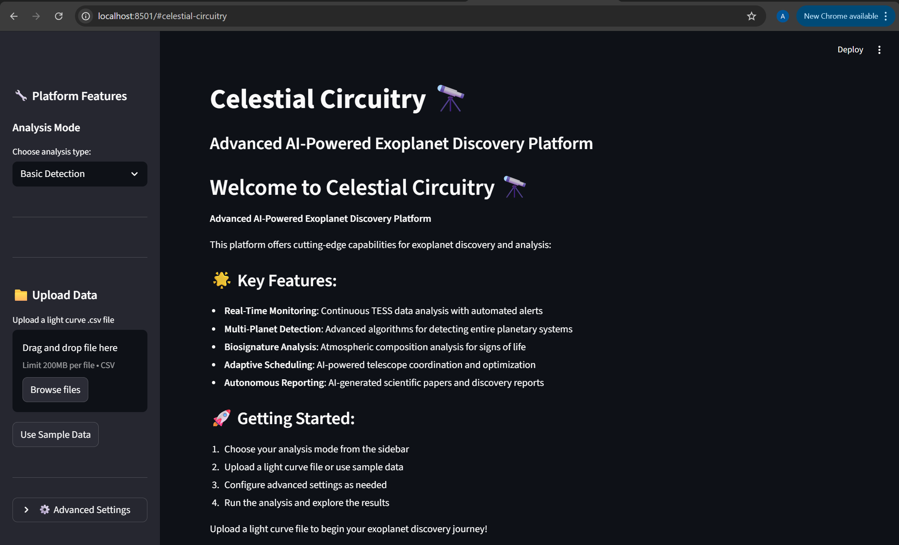
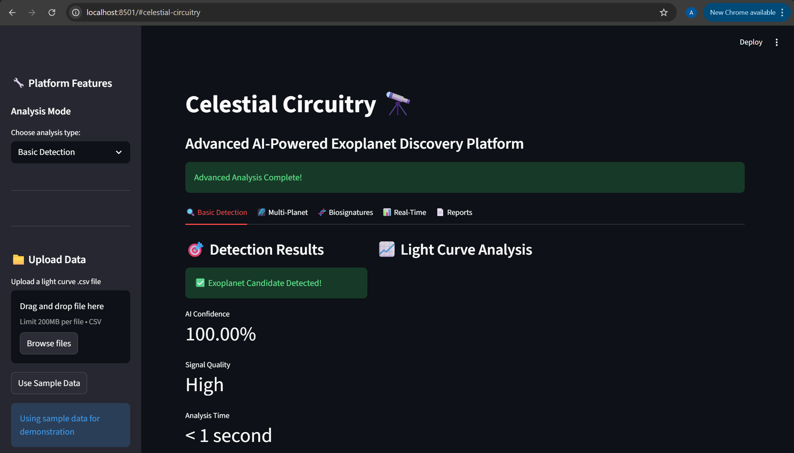

# 🚀 Automated Exoplanet Classifier 🔭

### AI-Powered Exoplanet Detection & Analysis Platform

An advanced **machine learning + Streamlit web application** designed to automate the detection of exoplanets using light curve data.

⚡ Transforms months of manual analysis into **seconds of AI-powered insights**.

---

## 📸 Demo / Preview

### Home Page


### Analysis Output


---

## 🌟 Key Features

* 🔍 **Exoplanet Detection** using light curve analysis
* 🧠 **Machine Learning Models** for classification
* 🌌 **Multi-Planet Detection Engine**
* 🧬 **Biosignature Analysis (O₂, H₂O, CH₄, CO₂)**
* 📊 **Interactive Streamlit Dashboard**
* ⚡ **Real-Time Data Processing & Visualization**

---

## 🛠️ Tech Stack

* **Language:** Python
* **Frontend:** Streamlit
* **ML Libraries:** Scikit-learn, XGBoost
* **Data Processing:** Pandas, NumPy
* **Visualization:** Matplotlib

---

## 📂 Project Structure

```
Automated-Exoplanet-Classifier/
│
├── app.py                     # Main Streamlit app
├── model_trainer.py          # ML model training
├── biosignature_detector.py  # Biosignature analysis
├── data_processor.py         # Data preprocessing
├── multi_planet_engine.py    # Multi-planet detection
├── requirements.txt
├── sample_data.csv
└── README.md
```

---

## ⚙️ Installation & Setup

```
# Clone repository
git clone https://github.com/arpitcse23/Automated-Exoplanet-Classifier.git

# Go to project folder
cd Automated-Exoplanet-Classifier

# Install dependencies
pip install -r requirements.txt

# Run the app
streamlit run app.py
```

---

## ▶️ Usage

1. Select **Analysis Mode**
2. Upload a **CSV light curve dataset**
3. Run detection
4. View results in interactive dashboard

---

## 📊 Input Data Format

```
time,flux
0.0,1.000
0.1,0.999
0.2,1.001
```

---

## 🧠 How It Works

* Preprocesses light curve data
* Applies ML models for pattern detection
* Identifies transit dips (possible exoplanets)
* Generates insights & visualizations

---

## 🚧 Future Improvements

* Deep Learning models (CNN/RNN)
* Better real-time data integration
* Deployment (Cloud / Web hosting)
* Improved UI/UX

---

## 🤝 Contributing

Contributions are welcome!
Feel free to fork and submit a PR.

---

## 📄 License

MIT License

---

## 👨‍💻 Author

**Arpit Yadav**
GitHub: https://github.com/arpitcse23

---

⭐ If you like this project, consider giving it a star!


